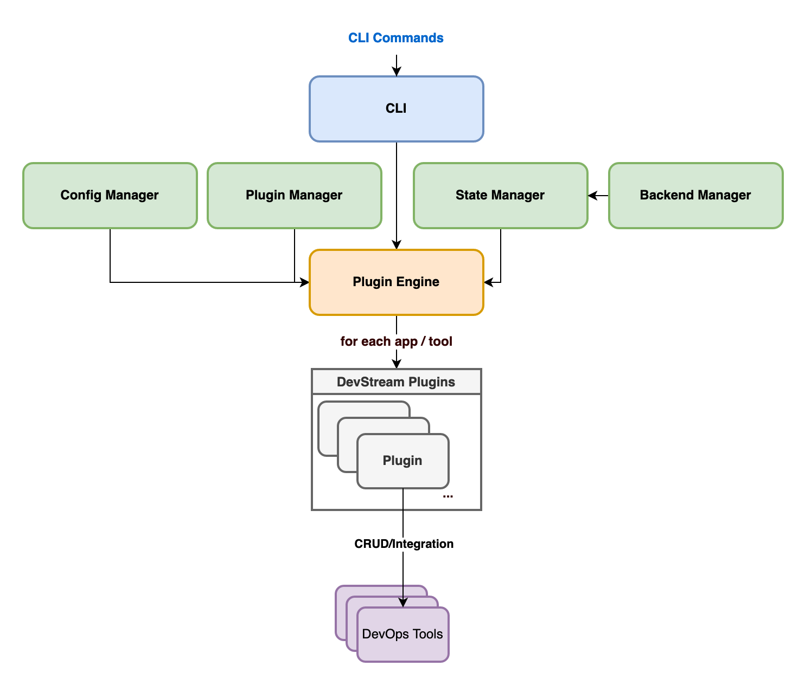

# Core Concepts Overview

Let's assume you're familiar with core Git, Docker, Kubernetes, Continuous Integration, Continuous Delivery, and GitOps concepts. 
These are the core concepts of DevStream.

## The Architecture of DevStream

The architecture image below shows how DevStream works in general:

## Workflow

## Config, Tool, State and Resource

The architecture documentation explains how in general DevStream works. If you haven't read it yet, make sure you do that before continuing with this document.

### 1. Config

DevStream defines your DevOps toolchain in config files.

We have three config files:

- main config file
- variable config file
- tool config file

The main config file contains:

- `varFile`: the file path for the var file
- `toolFile`: the file path for the tool file
- `pluginDir`: the directory path for the plugin directory, default: ~/.devstream/plugins, or use `-d` flag to specify a directory
- `state`: settings related to the state. For more information, see [here](./stateconfig.md).

The variable config file is a YAML file containing keys and values, which can be used in the tool config file.

The tool config file a list of _Tools_, each containing its name, instanceID (unique identifier), and options for that tool.

_Note: you can put multiple YAML files into the same one with three dashes (`---`) separating different files. Read more on this [here](https://stackoverflow.com/questions/50788277/why-3-dashes-hyphen-in-yaml-file) and [here](https://www.javatpoint.com/yaml-structure)._

### 2. Tool

- Each _Tool_ corresponds to a plugin, which can either be used to install, configure, or integrate some DevOps tools.
- Each _Tool_ has its Name, InstanceID, and Options, as defined [here](https://github.com/devstream-io/devstream/blob/main/internal/pkg/configmanager/toolconfig.go#L13).
- Each _Tool_ can have its dependencies, which are specified by the `dependsOn` keyword.

The dependency `dependsOn` is an array of strings, with each element being a dependency. Each dependency is named in the format of "TOOL_NAME.INSTANCE_ID". 
See [here](https://github.com/devstream-io/devstream/blob/main/examples/quickstart.yaml#L22) for example.

### 3. State

The _State_ records the current status of your DevOps toolchain. It contains the configuration of each tool, and the current status.

- The _State_ is actually a map of states, as defined [here](https://github.com/devstream-io/devstream/blob/main/internal/pkg/statemanager/state.go#L24).
- Each state in the map is a struct containing Name, Plugin, Options, and Resource, as defined [here](https://github.com/devstream-io/devstream/blob/main/internal/pkg/statemanager/state.go#L16).

### 4. Resource

- We call what the plugin created a _Resource_, and the `Read()` interface of that plugin returns a description of that resource, which is in turn stored as part of the state.

Config-State-Resource workflow:

