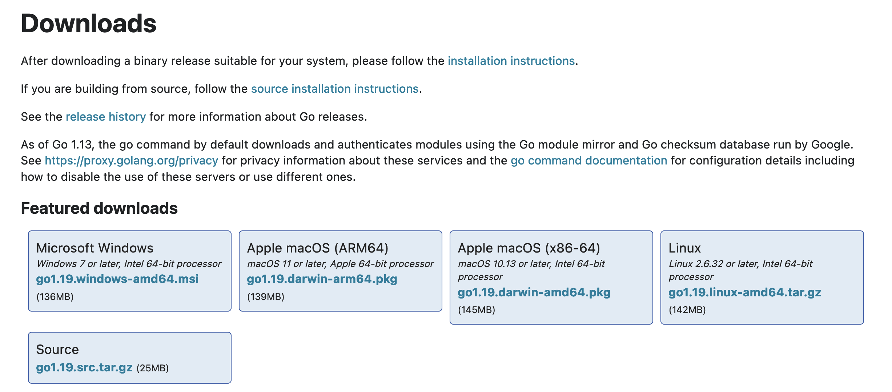
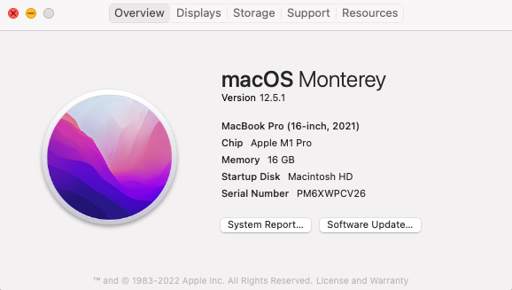

# Development Environment Setup

OK. So you want to get started with Golang/Kubernetes development. You've come to the right place. Read on.

## 1 Install Golang

[Head to the official website](https://go.dev/) and click the "Download" button:


Make sure you select the correct package according to your operating system and processor:



For Apple macOS users, click the apple logo in the menu bar, and choose "About This Mac" to check your chip:



---

## 2 Install Kubernetes

The easiest way to run a Kubernetes cluster locally is to run it in a Docker container.

### 2.1 Install Docker

[Head to the official website](https://www.docker.com/) and click the download button:


Again, please pay attention to the operating system and processor options. For Apple M1 mac users, choose the "Apple Chip" option. To check what processor you have, see the previous section in "About This Mac".

_After installation, make sure Docker is up and running._

### 2.2 Install Minikube

> Minikube is local Kubernetes, focusing on making it easy to learn and develop for Kubernetes.

> All you need is Docker (or similarly compatible) container or a Virtual Machine environment, and Kubernetes is a single command away.

_Note: there are other tools which can install a local K8s, such as `kind`, etc.; here we choose one of the most famous tools that is minikube as the demo._

First, go to the [official website of minikube](https://minikube.sigs.k8s.io/docs/start/), choose the right OS and architecture (again,) and download/install:


Alternatively, if you are using [Homebrew](https://brew.sh/) (if you don't know what it is, ignore this line,) you can simply run `brew install minikube`.

### 2.3 Install `kubectl`

Go to [Kubernetes' official documentation website](https://kubernetes.io/docs/tasks/tools/) and follow the guide to install kubectl. Choose your operating system:


Again, for macOS users, if you are using Homebrew package manager, you can install kubectl with Homebrew:

```bash
brew install kubectl
```

### 2.4 Start K8s

Run:

```bash
minikube start --driver=docker
```

> Note: if you would like to set Docker as the default driver for minikube, you can run:
> 
> ```bash
> minikube config set driver docker
> ```
> 
> Then next time when you want to start minikube, you can simply run `minikube start` without the `--driver=docker` parameter.

### 2.5 Check K8s Status

Run `minikube status`, and you should get similar output:

```shell
$ minikube status
minikube
type: Control Plane
host: Running
kubelet: Running
apiserver: Running
kubeconfig: Configured
```

Run `kubectl get node`, and you should get similar output:

```shell
$ kubectl get node
NAME       STATUS   ROLES           AGE   VERSION
minikube   Ready    control-plane   55s   v1.24.3
```

OK, now you have Golang and Kubernetes ready locally. Start coding!

---

## 3 Contribute to DevStream

Run:

```shell
git clone https://github.com/devstream-io/devstream.git
```

and start from there!

For example, you can try a local build:

```shell
make build -j10 VERSION=0.8.0
```

Or, maybe you would like to have a go with it first? Check our [quickstart guide](../quickstart.md). Happy hacking!
