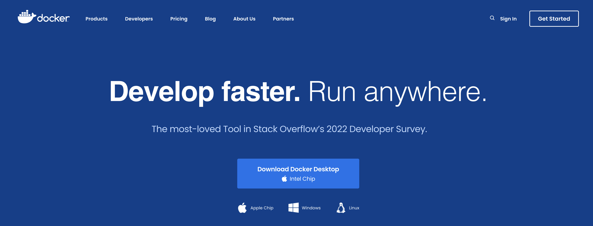
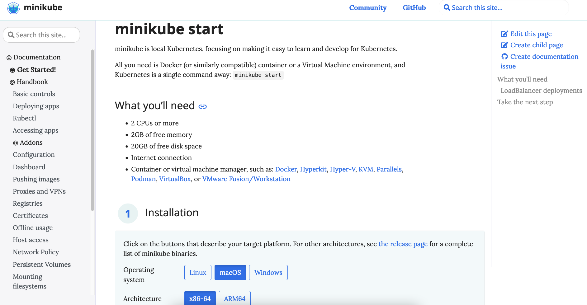

# 开发环境搭建

好。你想开始搞点Golang/Kubernetes开发了。恭喜你，你来对地方了。请继续阅读。

## 1 安装Golang

[前往Golang官网](https://go.dev/)并点击“下载”按钮：


根据你的操作系统和处理器来选择正确的软件包版本：


对于Apple macOS用户，点击菜单栏中的苹果标志，然后选择“关于本机”以查看您的芯片：


---

## 2 安装Kubernetes

在本地跑一个Kubernetes集群最简单的方法是在Docker容器中。

### 2.1 安装Docker

[前往Docker官网](https://www.docker.com/)点击下载按钮：



同样请注意操作系统和处理器选项。对于Apple M1 mac用户，选择“Apple Chip”选项。如果想确认你的处理器是Apple还是Intel，请参阅上一节中的“关于本机”部分。

_安装后，请确保Docker已启动并正在运行中。_

### 2.2 安装Minikube

Minikube在本地搭建Kubernetes的一种简单的方式，让你可以不被安装K8s而困扰，从而可以专注于K8s的学习和开发。

你所需要的只是Docker容器或虚拟机环境，然后执行一个命令，你就可以拥有一个本地K8s集群了。

_注意：其实有很多种可以安装本地K8s的工具，如`kind`等；在这里，我们选择了最著名的工具之一minikube作为演示。_

首先，访问[minikube官网](https://minikube.sigs.k8s.io/docs/start/)，选择正确的操作系统和架构，并下载/安装：



或者，如果你在用[Homebrew](https://brew.sh/)的话（如果你不知道它是啥，请忽略）你可以通过运行`brew install minikube`来安装。

### 2.3 安装`kubectl`

前往[Kubernetes的官方文档站点](https://kubernetes.io/docs/tasks/tools/)然后按照指南来安装kubectl。选择您的操作系统：


需要再次强调的是，对于macOS用户，如果你用Homebrew包管理器，那么你可以用brew装kubectl：

```bash
brew install kubectl
```

### 2.4 启动K8s集群

运行：

```bash
minikube start --driver=docker
```

> 注意：如果您想将 Docker 设置为 minikube 的默认驱动程序，您可以运行：
>
> ```bash
> minikube config set driver docker
> ```
>
> 然后下次要启动 minikube 时，只需运行`minikube start`即可，就不用再传`--driver=docker`参数了。

### 2.5 检查K8s集群状态

运行`minikube status`，然后你可以得到类似的输出：

```shell
$ minikube status
minikube
type: Control Plane
host: Running
kubelet: Running
apiserver: Running
kubeconfig: Configured
```

运行`kubectl get node`，然后你应该能看到如下的输出：

```shell
$ kubectl get node
NAME       STATUS   ROLES           AGE   VERSION
minikube   Ready    control-plane   55s   v1.24.3
```

好，现在Golang和Kubernetes就都准备好啦，可以开始写代码啦！

---

## 3 为DevStream贡献代码

执行:

```shell
git clone https://github.com/devstream-io/devstream.git
```

然后从这儿开始！

比如，你可以尝试一下本地编译DevStream：

```shell
make build -j10 VERSION=0.8.0
```

或者可能你想先试用一下DevStream？没问题，参考我们的[快速开始](../quickstart.zh.md)文档！

Happy hacking!
