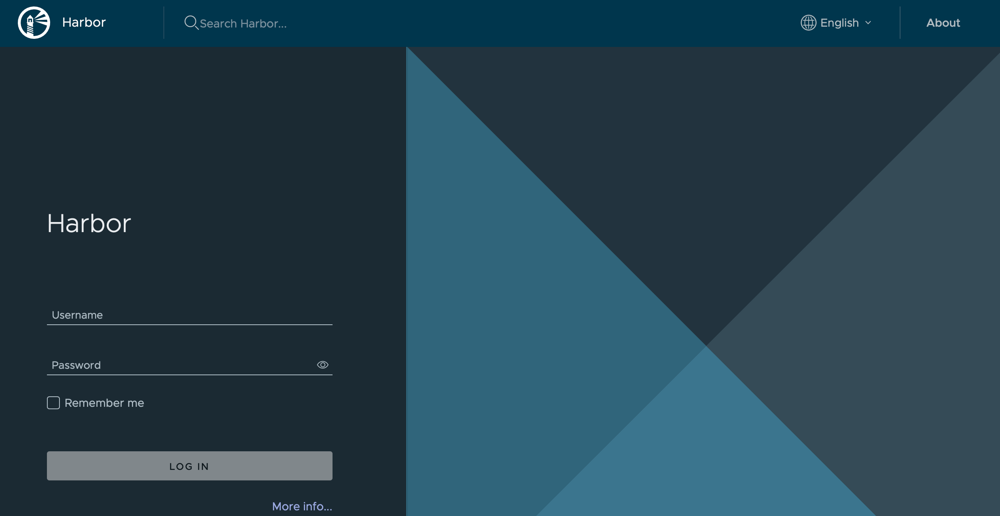
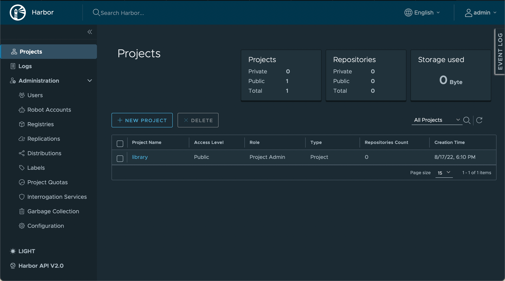

# harbor Plugin

The `harbor` plugin is used to deploy and manage [Harbor](https://goharbor.io/).

Currently, two popular ways to deploy Harbor are using _docker compose_or _helm_.

There are also two DevStream plugins, `harbor-docker` (docker-compose deployment) and `harbor` (helm deployment.) They will be merged into one soon, but we mainly use the helm one at the moment.

In this doc, we will do a development environment deploy with minikube/kind. You can do the same in any Kubernetes cluster, but some steps need adjustment.

## 1 Prerequisites

- An existing Kubernetes cluster, version > 1.10
- StorageClass

If you are sure you already have a StorageClass configured for your K8s cluster, you can [_skip this section and move on to the next_](#2-harbor-architecture).

If you are uncertain about StorageClass, here's a bit more explanation:

> Depending on the installation method, your Kubernetes cluster may be deployed with an existing StorageClass marked as default. This default StorageClass is then used to dynamically provision storage for PersistentVolumeClaims that do not require any specific storage class. See [PersistentVolumeClaim documentation](https://kubernetes.io/docs/concepts/storage/persistent-volumes/#persistentvolumeclaims) for details.

Examples:

- For local clusters created by `minikube,` there is already a default standard StorageClass using hostpath.
- For local clusters created by `kind,` there is a default standard StorageClass using rancher.io/local-path.
- For K8s-as-a-Service in public cloud providers, it's highly likely that a default StorageClass is created. For example, for AWS EKS, the default is gp2, using AWS EBS. Note that the pre-installed default StorageClass may not fit well with your expected workload; for example, it might provision storage that is too expensive. If this is the case, you can either change the default StorageClass or disable it thoroughly to avoid the dynamic provisioning of storage. For more information on this topic, see [the official doc here](https://kubernetes.io/docs/tasks/administer-cluster/change-default-storage-class/).

## 2 Harbor Architecture


## 3 Using the Harbor Plugin with DevStream

### 3.1 Quickstart

The following content is an example of the "tool file".

For more information on the main config, the tool file and the var file of DevStream, see [Core Concepts Overview](../core-concepts/core-concepts.md#1-config) and [DevStream Configuration](../core-concepts/config.md).

For a local testing and developing purpose, we can deploy Harbor quickly using the minimal config as follows:

```yaml
tools:
- name: harbor
  instanceID: default
  dependsOn: [ ]
  options:
    chart:
      valuesYaml: |
        externalURL: http://127.0.0.1
        expose:
          type: nodePort
          tls:
            enabled: false
        chartmuseum:
          enabled: false
        notary:
          enabled: false
        trivy:
          enabled: false
```

_Note: the config above is the "tool config" of DevStream. For a full DevStream config, we need the core config. See [here](../core-concepts/config.md)._

After running `dtm apply`, we can see the following resources in the "harbor" namespace:

- **Deployment** (`kubectl get deployment -n harbor`)

Most Harbor-related services run as Deployments:

```shell
NAME                READY   UP-TO-DATE   AVAILABLE   AGE
harbor-core         1/1     1            1           2m56s
harbor-jobservice   1/1     1            1           2m56s
harbor-nginx        1/1     1            1           2m56s
harbor-portal       1/1     1            1           2m56s
harbor-registry     1/1     1            1           2m56s
```

- **StatefulSet** (`kubectl get statefulset -n harbor`)

Harbor depends on Postgres and Redis, which are deployed as StatefulSets. Notice that these dependencies are not deployed to a production-ready level with highly-availability and redundancy.

```shell
NAME              READY   AGE
harbor-database   1/1     3m40s
harbor-redis      1/1     3m40s
```

- **Service** (`kubectl get service -n harbor`)

By default, Harbor is exposed on port 30002 as type NodePort:

```shell
NAME                TYPE        CLUSTER-IP       EXTERNAL-IP   PORT(S)             AGE
harbor              NodePort    10.99.177.6      <none>        80:30002/TCP        4m17s
harbor-core         ClusterIP   10.106.220.239   <none>        80/TCP              4m17s
harbor-database     ClusterIP   10.102.102.95    <none>        5432/TCP            4m17s
harbor-jobservice   ClusterIP   10.98.5.49       <none>        80/TCP              4m17s
harbor-portal       ClusterIP   10.105.115.5     <none>        80/TCP              4m17s
harbor-redis        ClusterIP   10.104.100.167   <none>        6379/TCP            4m17s
harbor-registry     ClusterIP   10.106.124.148   <none>        5000/TCP,8080/TCP   4m17s
```

- **PersistentVolumeClaim** (`kubectl get pvc -n harbor`)

Harbor requires a few volumes, including volumes for Postgres and Redis:

```shell
NAME                              STATUS   VOLUME                                     CAPACITY   ACCESS MODES   STORAGECLASS   AGE
data-harbor-redis-0               Bound    pvc-5b6b5eb4-c40d-4f46-8f19-ff3a8869e56f   1Gi        RWO            standard       5m12s
database-data-harbor-database-0   Bound    pvc-d7ccaf1f-c450-4a16-937a-f55ad0c7c18d   1Gi        RWO            standard       5m12s
harbor-jobservice                 Bound    pvc-9407ef73-eb65-4a56-8720-a9ddbcb76fef   1Gi        RWO            standard       5m13s
harbor-registry                   Bound    pvc-34a2b88d-9ff2-4af4-9faf-2b33e97b971f   5Gi        RWO            standard       5m13s
```

- **PersistentVolume** (`kubectl get pv`)

For a quick start (for example, with a local kind/minikube cluster,) we don't have to configure the StorageClass; so the resources are created with the default StorageClass:

```shell
pvc-34a2b88d-9ff2-4af4-9faf-2b33e97b971f   5Gi        RWO            Delete           Bound         harbor/harbor-registry                    standard                5m22s
pvc-5b6b5eb4-c40d-4f46-8f19-ff3a8869e56f   1Gi        RWO            Delete           Bound         harbor/data-harbor-redis-0                standard                5m22s
pvc-9407ef73-eb65-4a56-8720-a9ddbcb76fef   1Gi        RWO            Delete           Bound         harbor/harbor-jobservice                  standard                5m22s
pvc-d7ccaf1f-c450-4a16-937a-f55ad0c7c18d   1Gi        RWO            Delete           Bound         harbor/database-data-harbor-database-0    standard                5m22s
```

In this example, our default StorageClass is(`kubectl get storageclass`):

```shell
NAME                 PROVISIONER                RECLAIMPOLICY   VOLUMEBINDINGMODE   ALLOWVOLUMEEXPANSION   AGE
standard (default)   k8s.io/minikube-hostpath   Delete          Immediate           false                  20h
```

### 3.2 Using Harbor

We can forward the port of the Harbor service and log in:

```shell
kubectl port-forward -n harbor service/harbor 8080:80
```



And the default login user/pwd is: `admin/Harbor12345`. You will see the dashboard after a successful login:




### 3.3 Default Config

The `harbor` plugin provides default values for many options:

| key                | default value            | description                         |
| ----               | ----                     | ----                                |
| chart.chartPath    | ""                       | local chart path                    |
| chart.chartName    | harbor/harbor            | helm chart name                     |
| chart.timeout      | 10m                      | timeout for helm install            |
| chart.upgradeCRDs  | true                     | update CRDs or not (if any)         |
| chart.releaseName  | harbor                   | helm release name                   |
| chart.wait         | true                     | wait till deployment finishes       |
| chart.namespace    | harbor                   | namespace                           |
| repo.url           | https://helm.goharbor.io | helm repo URL                       |
| repo.name          | harbor                   | helm repo name                      |

A maximum config is as follows:

```yaml
--8<-- "harbor.yaml"
```
