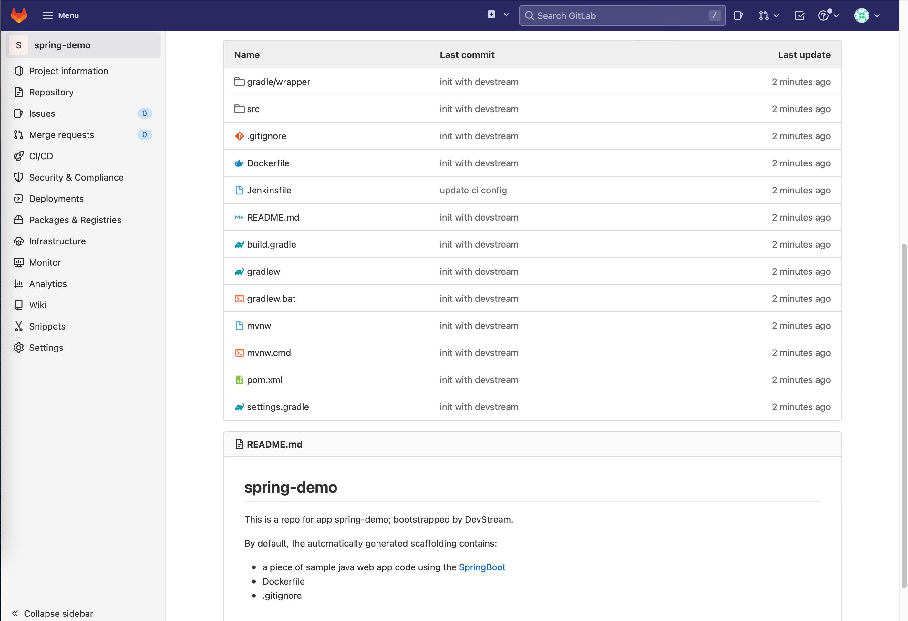
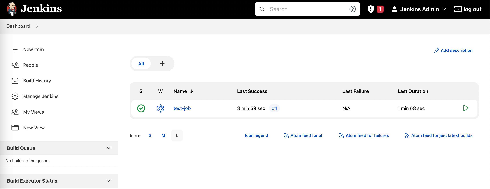
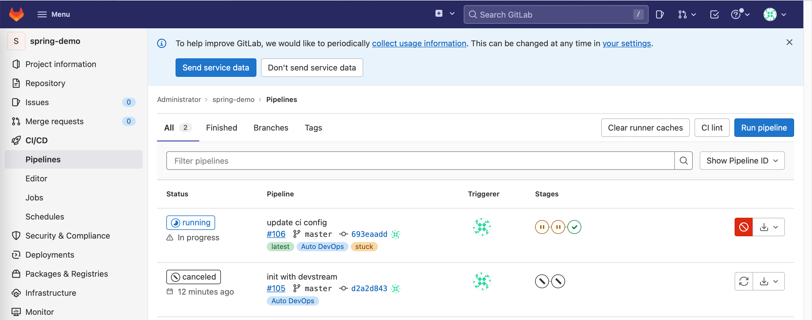

# jenkins-pipeline 插件

`jenkins-pipeline` 插件用于打通 GitHub/GitLab 和 Jenkins，实现自动化创建 Jenkins Pipeline 的功能。

*注意：当前只支持 GitLab，GitHub 将在近期被支持。*

本文将演示：

1. 通过 [`repo-scaffolding`](../repo-scaffolding.zh) 插件在 GitLab 上创建一个 Java Sprint Boot 项目脚手架；
2. 通过 `jenkins-pipeline` 插件在 Jenkins 上创建一条 Java Spring Boot 的 CI 流水线；
3. 通过 `jenkins-pipeline` 插件实现在 GitLab 和 Jenkins 上分别配置相应参数，实现当 GitLab 上的代码库有 push 或者 merge 事件时，自动触发 Jenkins 上的流水线运行，同时流水线的执行结果自动回写到 GitLab 上。

## 1、前置要求

**必须满足**

- 一套可用的 Jenkins 环境
- 一套可用的 GitLab 环境
- 一套可用的 Harbor 环境
- Jenkins 与 GitLab、Harbor 网络互通
- 执行 dtm 的主机与 Jenkins、GitLab 网络互通

*注意：当前插件暂时只支持对接使用 dtm 部署的 Jenkins。*

本文基于如下环境编写：

- **系统**：一台装有 CentOS 7 的云主机；
- **k8s**：minikube 方式部署的单节点集群；
- **Jenkins、Harbor 和 GitLab**：使用 dtm 方式部署。

## 2、配置

你需要预先准备好 GitLab 的 token 和镜像仓库（Harbor 等）的密码，然后配置到环境变量里，例如（记得替换占位字符）：

```shell
export IMAGE_REPO_PASSWORD=YOUR_IMAGE_REPO_PASSWORD
export GITLAB_TOKEN=YOUR_GITLAB_TOKEN
```

然后准备 DevStream 插件配置：

```yaml
tools:
- name: repo-scaffolding
  instanceID: springboot
  dependsOn: []
  options:
    destinationRepo:
      owner: root
      repo: spring-demo
      branch: master
      repoType: gitlab
      baseURL: YOUR_GITLAB_ADDR
    sourceRepo:
      owner:  devstream-io
      repo: dtm-repo-scaffolding-java-springboot
      repoType: github
- name: jenkins-pipeline
  instanceID: default
  dependsOn: []
  options:
    jenkins:
      url: YOUR_JENKINS_ADDR
      user: admin
      enableRestart: true
    scm:
      projectURL: YOUR_JENKINS_ADDR/root/spring-demo
      projectBranch: master
    pipeline:
      jobName: test-job
      jenkinsfilePath: https://raw.githubusercontent.com/devstream-io/dtm-jenkins-pipeline-example/main/springboot/Jenkinsfile
      imageRepo:
        url: YOUR_HARBOR_ADDR
        user: admin
```

上述配置文件中使用的 GitLab、Jenkins 和 Harbor 访问地址需要替换成你的环境中实际地址。例如：

- **YOUR_GITLAB_ADDR**: http://54.71.232.26:30080
- **YOUR_JENKINS_ADDR**: http://54.71.232.26:30080
- **YOUR_HARBOR_ADDR**: http://harbor.example.com:80

除了这几个必须修改的配置项外，其他配置项你可以在确保理解含义的前提下灵活决定是否调整。

*注意：这个配置示例仅是 tool config，完整的 DevStream 配置文件还需要补充 core config 等内容，具体参考[这个文档](../../core-concepts/config.zh)。*

## 3、开始执行

你可以使用 `dtm apply` 命令开始应用当前配置：

- `dtm apply -f config-jenkins-pipeline.yaml -y`

这个过程的日志大致如下：

```shell
2022-09-05 09:01:08 ℹ [INFO]  Apply started.
2022-09-05 09:01:08 ℹ [INFO]  Using dir </root/.devstream/plugins> to store plugins.
2022-09-05 09:01:09 ℹ [INFO]  Using local backend. State file: devstream.state.
2022-09-05 09:01:09 ℹ [INFO]  Tool (repo-scaffolding/springboot) found in config but doesn't exist in the state, will be created.
2022-09-05 09:01:09 ℹ [INFO]  Tool (jenkins-pipeline/default) found in config but doesn't exist in the state, will be created.
2022-09-05 09:01:09 ℹ [INFO]  Start executing the plan.
2022-09-05 09:01:09 ℹ [INFO]  Changes count: 2.
2022-09-05 09:01:09 ℹ [INFO]  -------------------- [  Processing progress: 1/2.  ] --------------------
2022-09-05 09:01:09 ℹ [INFO]  Processing: (repo-scaffolding/springboot) -> Create ...
2022-09-05 09:01:10 ✔ [SUCCESS]  Tool (repo-scaffolding/springboot) Create done.
2022-09-05 09:01:10 ℹ [INFO]  -------------------- [  Processing progress: 2/2.  ] --------------------
2022-09-05 09:01:10 ℹ [INFO]  Processing: (jenkins-pipeline/default) -> Create ...
2022-09-05 09:01:10 ℹ [INFO]  Secret jenkins/docker-config has been created.
2022-09-05 09:01:14 ✔ [SUCCESS]  Tool (jenkins-pipeline/default) Create done.
2022-09-05 09:01:14 ℹ [INFO]  -------------------- [  Processing done.  ] --------------------
2022-09-05 09:01:14 ✔ [SUCCESS]  All plugins applied successfully.
2022-09-05 09:01:14 ✔ [SUCCESS]  Apply finished.
```

## 4、执行结果

你可以在 GitLab、Jenkins 上查看本次执行结果：

- **Repo Scaffolding**

首先你可以在 GitLab 上可以看 repo scaffolding 的效果，dtm 为你创建了一个 Java Spring Boot 项目脚手架：



- **Pipeline**

接着你可以在 Jenkins 上看到刚才 dtm 为你创建的 Pipeline：



如果你点开这个 test-job，就能看到它已经被触发了一次，执行结果如下：


- **状态回写**

然后你可以回到 GitLab，看一下 Jenkins Pipeline 的执行结果有没有被成功回写：



- **检查镜像**

通过 Jenkins 的日志你可以找到刚才 push 的镜像地址为 `harbor.example.com:80/library/spring-demo:latest`：


// TODO(daniel-hutao): 补充 Harbor 截图

最后你可以通过 `docker pull` 下载该镜像：


## 配置详解

当前插件完整配置如下：

``` yaml
--8<-- "jenkins-pipeline.yaml"
```
