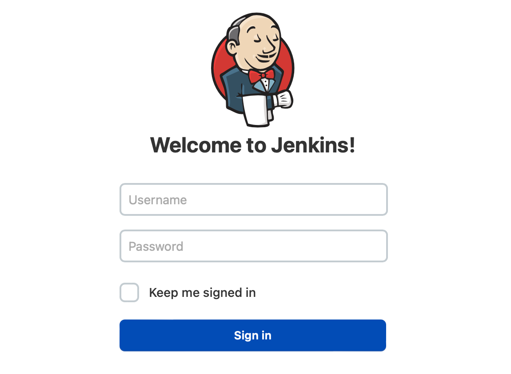
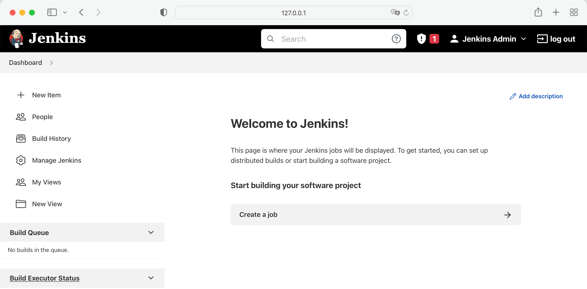

# jenkins 插件

`jenkins` 插件用于部署、管理 [Jenkins](https://www.jenkins.io) 应用。

Jenkins 的部署方式有很多种，比如 Docker、Kubernetes、Jar 包等等，本插件使用 helm 方式实现 Jenkins 在 Kubernetes 之上的部署逻辑，
使用 Jenkins 官方提供的 [chart 包](https://github.com/jenkinsci/helm-charts)。

## 1、前置要求

**必须满足**

- 有一个可用的 Kubernetes 集群，版本 1.10+
- 配置好 StorageClass

**可选满足**

- 配置好 Ingress 控制器（如果需要使用 Ingress 暴露服务）

如果你还没有准备好一个满足上述要求的 Kubernetes 集群，可以参考 [minikube 文档](https://minikube.sigs.k8s.io/docs/start/) 快速创建一个 Kubernetes 测试集群。
在成功执行完 `minikube start` 命令后，假如需要启用 Ingress，可以通过 `minikube addons enable ingress` 命令完成 Ingress 控制器的启用。
因为 minikube 方式部署的 Kubernetes 集群会自带一个名字为 standard 的 default StorageClass，所以当前集群满足上述全部前置要求。

## 2、开始部署

下文将介绍如何配置 `jenkins` 插件，完成 Jenkins 应用的部署。本文演示环境为一台有通过 minikube 方式部署的单节点 Kubernetes 集群的 Macbook/m1 电脑。

## 2.1、快速开始

下面的配置文件展示的是"tool file"的内容。

关于更多关于DevStream的主配置、tool file、var file的信息，请阅读[核心概念概览](../core-concepts/core-concepts.zh.md)和[DevStream配置](../core-concepts/config.zh.md).

如果仅是用于开发、测试等目的，希望快速完成 Jenkins 的部署，可以使用如下配置快速开始：

```yaml
tools:
# name of the tool
- name: jenkins
  # id of the tool instance
  instanceID: default
  # format: name.instanceID; If specified, dtm will make sure the dependency is applied first before handling this tool.
  dependsOn: [ ]
  # options for the plugin
  options:
    chart:
      # custom configuration. You can refer to [Jenkins values.yaml](https://github.com/jenkinsci/helm-charts/blob/main/charts/jenkins/values.yaml)
      valuesYaml: |
        serviceAccount:
          create: true
          name: jenkins
        controller:
          adminUser: "admin"
          adminPassword: "changeme"
          serviceType: NodePort
          nodePort: 32000
```

*注意：这个配置示例仅是 tool config，完整的 DevStream 配置文件还需要补充 core config 等内容，具体参考[这个文档](../core-concepts/config.zh.md)。*

在成功执行 `dtm apply` 命令后，我们可以在 jenkins 命名空间下看到下述主要资源：

- **StatefulSet** (`kubectl get statefulset -n jenkins`)

```shell
NAME      READY   AGE
jenkins   1/1     3m10s
```

- **Service** (`kubectl get service -n jenkins`)

```shell
NAME            TYPE        CLUSTER-IP      EXTERNAL-IP   PORT(S)          AGE
jenkins         NodePort    10.103.31.213   <none>        8080:32000/TCP   3m30s
jenkins-agent   ClusterIP   10.100.239.11   <none>        50000/TCP        3m30s
```

- **PersistentVolumeClaim** (`kubectl get pvc -n jenkins`)

```shell
NAME      STATUS   VOLUME                                     CAPACITY   ACCESS MODES   STORAGECLASS   AGE
jenkins   Bound    pvc-f474b131-dea8-4ac3-886b-8549da2cad56   8Gi        RWO            standard       3m50s
```

- **PersistentVolume** (`kubectl get pv`)

```shell
NAME                                       CAPACITY   ACCESS MODES   RECLAIM POLICY   STATUS     CLAIM                STORAGECLASS   REASON   AGE
pvc-f474b131-dea8-4ac3-886b-8549da2cad56   8Gi        RWO            Delete           Bound      jenkins/jenkins      standard                4m10s
```

前面我们提到过 Kubernetes 集群里需要有一个 StorageClass，当前 Jenkins 所使用的 pv 来自于集群中 default StorageClass：

```shell
NAME                 PROVISIONER                RECLAIMPOLICY   VOLUMEBINDINGMODE   ALLOWVOLUMEEXPANSION   AGE
standard (default)   k8s.io/minikube-hostpath   Delete          Immediate           false                  20h
```

到这里，我们就可以通过 NodePort 方式访问 Jenkins 登录页面了。但是由于我们的 Kubernetes 测试集群使用的是 minikube 方式部署，
而不是 kubeadm 这种直接在主机上部署 Kubernetes 相关组件的方式，所以这里还需要一步操作：

- **服务暴露** (`minikube service jenkins -n jenkins`)

```shell
|-----------|---------|-------------|---------------------------|
| NAMESPACE |  NAME   | TARGET PORT |            URL            |
|-----------|---------|-------------|---------------------------|
| jenkins   | jenkins | http/8080   | http://192.168.49.2:32000 |
|-----------|---------|-------------|---------------------------|
🏃  Starting tunnel for service jenkins.
|-----------|---------|-------------|------------------------|
| NAMESPACE |  NAME   | TARGET PORT |          URL           |
|-----------|---------|-------------|------------------------|
| jenkins   | jenkins |             | http://127.0.0.1:65398 |
|-----------|---------|-------------|------------------------|
🎉  Opening service jenkins/jenkins in default browser...
❗  Because you are using a Docker driver on darwin, the terminal needs to be open to run it.
```

这时候 minikube 会自动打开浏览器，跳转到 http://127.0.0.1:65398 页面(如果没有自动跳转，可以手动打开浏览器，输入这个 url；注意：根据你的命令行输出内容修改 url 中的端口号)：



- **登录**

如果你浏览过前面我们使用的"最小化配置文件"，肯定已经注意到了里面和用户名、密码相关的配置，没错，通过 admin/changeme 就可以登录 Jenkins 了！



最后，记得修改密码哦！

### 2.2、默认配置

`jenkins` 插件的配置项多数都有默认值，具体默认值信息如下表：

| 配置项              | 默认值                     | 描述                                |
| ----               | ----                      | ----                               |
| chart.chartPath    | ""                      | 本地 chart 包路径                      |
| chart.chartName    | jenkins/jenkins           | helm chart 包名称                   |
| chart.timeout      | 5m                        | helm install 的超时时间              |
| chart.upgradeCRDs  | true                      | 是否更新 CRDs（如果有）               |
| chart.releaseName  | jenkins                   | helm 发布名称                        |
| chart.wait         | true                      | 是否等待部署完成                      |
| chart.namespace    | jenkins                   | 部署的命名空间                        |
| repo.url           | https://charts.jenkins.io | helm 仓库地址                        |
| repo.name          | jenkins                   | helm 仓库名                          |

因此完整的配置文件应该是这样：

```yaml
--8<-- "jenkins.yaml"
```

目前除了 `valuesYaml` 字段和默认配置，其它所有示例参数均为必填项。

### 2.3、持久化存储

前面"快速开始"中我们使用了 default StorageClass 来分配 pv 完成了 Jenkins 数据落到本地磁盘的过程。
因此如果你的环境中有其他 StorageClass 可以支持 pv 数据落到远程存储，就可以通过如下配置来自定义 Jenkins 所使用的 StorageClass：

```yaml
tools:
# name of the tool
- name: jenkins
  # id of the tool instance
  instanceID: default
  # format: name.instanceID; If specified, dtm will make sure the dependency is applied first before handling this tool.
  dependsOn: [ ]
  # options for the plugin
  options:
    chart:
      # custom configuration. You can refer to [Jenkins values.yaml](https://github.com/jenkinsci/helm-charts/blob/main/charts/jenkins/values.yaml)
      valuesYaml: |
        serviceAccount:
          create: true
          name: jenkins
        persistence:
          storageClass: nfs
        controller:
          adminUser: "admin"
          adminPassword: "changeme"
          serviceType: NodePort
          nodePort: 32000
```

上述配置以 nfs StorageClass 为例，请记得将 `persistence.storageClass` 修改成你的环境中真实 StorageClass 的名字。

### 2.4、服务暴露

在"快速开始"中我们通过 NodePort 方式来暴露 Jenkins 服务。如果你想通过 Ingress 来暴露服务，可以这样配置：

```yaml
tools:
# name of the tool
- name: jenkins
  # id of the tool instance
  instanceID: default
  # format: name.instanceID; If specified, dtm will make sure the dependency is applied first before handling this tool.
  dependsOn: [ ]
  # options for the plugin
  options:
    chart:
      # custom configuration. You can refer to [Jenkins values.yaml](https://github.com/jenkinsci/helm-charts/blob/main/charts/jenkins/values.yaml)
      valuesYaml: |
        serviceAccount:
          create: true
          name: jenkins
        persistence:
          storageClass: ""
        controller:
          adminUser: "admin"
          adminPassword: "changeme"
          ingress:
            enabled: true
            hostName: jenkins.example.com
```

使用当前配置成功执行 `dtm apply` 命令后，可以看到环境里的 Ingress 资源如下：

- **Ingress** (`kubectl get ingress -n jenkins`)

```shell
NAMESPACE   NAME      CLASS   HOSTS                 ADDRESS        PORTS   AGE
jenkins     jenkins   nginx   jenkins.example.com   192.168.49.2   80      9m13s
```

至此，只要 DNS 服务器能够解析到域名 jenkins.example.com，那么你就可以通过这个域名来访问 Jenkins 了。
当然，没有合适的 DNS 服务器的情况下，你也可以通过修改 hosts 记录来完成静态域名解析，将如下这行配置追加到 `/etc/hosts` 文件中：

```shell
192.168.49.2 jenkins.example.com
```

### 2.5、推荐配置

// TODO(daniel-hutao): 继续细化

```yaml
tools:
# name of the tool
- name: jenkins
  # id of the tool instance
  instanceID: default
  # format: name.instanceID; If specified, dtm will make sure the dependency is applied first before handling this tool.
  dependsOn: [ ]
  # options for the plugin
  options:
    chart:
      # custom configuration. You can refer to [Jenkins values.yaml](https://github.com/jenkinsci/helm-charts/blob/main/charts/jenkins/values.yaml)
      valuesYaml: |
        serviceAccount:
          create: true
          name: jenkins
        persistence:
          storageClass: ""
        controller:
          adminUser: "admin"
          adminPassword: "changeme"
          ingress:
            enabled: true
            hostName: jenkins.example.com
          installPlugins:
            - kubernetes:3600.v144b_cd192ca_a_
            - workflow-aggregator:581.v0c46fa_697ffd
            - git:4.11.3
            - configuration-as-code:1512.vb_79d418d5fc8
          additionalPlugins:
            # install "GitHub Pull Request Builder" plugin, see https://plugins.jenkins.io/ghprb/ for more details
            - ghprb
            # install "OWASP Markup Formatter" plugin, see https://plugins.jenkins.io/antisamy-markup-formatter/ for more details
            - antisamy-markup-formatter
        # Enable HTML parsing using OWASP Markup Formatter Plugin (antisamy-markup-formatter), useful with ghprb plugin.
        enableRawHtmlMarkupFormatter: true
        # Jenkins Configuraction as Code, refer to https://plugins.jenkins.io/configuration-as-code/ for more details
        # notice: All configuration files that are discovered MUST be supplementary. They cannot overwrite each other's configuration values. This creates a conflict and raises a ConfiguratorException.
        JCasC:
          defaultConfig: true
```

## 3、状态管理

DevStream 的默认状态文件为 devstream.state，可以通过配置文件中的 state.options 字段来自定义。
jenkins 插件会保存如下状态：

```yaml
jenkins_default:
  name: jenkins
  instanceid: default
  dependson: []
  options:
    chart:
      valuesYaml: |
        serviceAccount:
          create: true
          name: jenkins
        controller:
          adminUser: "admin"
          ingress:
            enabled: true
            hostName: jenkins.example.com
  resource:
    outputs:
      jenkins_url: http://jenkins.jenkins:8080
    valuesYaml: |
      serviceAccount:
        create: true
        name: jenkins
      controller:
        adminUser: "admin"
        ingress:
          enabled: true
          hostName: jenkins.example.com
    workflows: |
      statefulsets:
        - name: jenkins
          ready: true
```

其中 resource 部分保存的是资源实例的最新状态，也就是这部分：

```yaml
outputs:
  jenkins_url: http://jenkins.jenkins:8080
valuesYaml: |
  serviceAccount:
    create: true
    name: jenkins
  controller:
    adminUser: "admin"
    ingress:
      enabled: true
      hostName: jenkins.example.com
workflows: |
  statefulsets:
    - name: jenkins
      ready: true
```

换言之，目前 jenkins 插件关注的状态主要是自身 StatefulSet 资源状态和 valuesYaml 的配置，也就是在两种情况下会判定状态漂移，从而触发更新操作：

1. StatefulSet 状态变更
2. valuesYaml 部分配置变更

## 4、插件输出

在上一小节我们看到了 jenkins 插件的状态中保存了一个 outputs 字段，内容是 `jenkins_url: http://jenkins.jenkins:8080`，
所以其他插件的配置中可以通过`${{jenkins.default.outputs.jenkins_url}}` 的语法读取到 `http://jenkins.jenkins:8080`。

更多关于"插件输出"的内容，请阅读[这个文档](../core-concepts/output.zh.md)。

## 5、离线环境部署

// TODO(daniel-hutao): 本节内容近期将持续补充完善

### 5.1、Helm Chart 包

如果需要在离线环境部署 Jenkins，你需要下载对应的 helm chart 包：

```shell
helm repo add jenkins https://charts.jenkins.io
helm repo update
helm search repo jenkins -l
helm pull jenkins/jenkins --version=4.2.5
```

这时你会得到一个 `jenkins-4.2.5.tgz` 文件，你可以将其存放到一个合适的目录，比如 `~/devstream-test/jenkins-4.2.5.tgz`，然后在配置文件就可以这样引用这个 chart 包了：

```yaml
tools:
- name: jenkins
  instanceID: default
  dependsOn: [ ]
  options:
    chart:
      chartPath: "~/devstream-test/jenkins-4.2.5.tgz"
```

### 5.2、容器镜像

`jenkins` 插件支持使用自定义容器镜像，你需要先在 valuesYaml 部分加上如下配置：

```yaml
valuesYaml: |
  controller:
    image: [[ imageRepo ]]/devstreamdev/jenkins
    tag: 2.361.1-jdk11-dtm-0.1
    imagePullPolicy: "IfNotPresent"
    sidecars:
      configAutoReload:
        image: [[ imageRepo ]]/kiwigrid/k8s-sidecar:1.15.0
  agent:
    image: [[ imageRepo ]]/jenkins/inbound-agent
    tag: 4.11.2-4
  backup:
    image:
      repository: [[ imageRepo ]]/maorfr/kube-tasks
      tag: 0.2.0
```

这段配置中留了一个变量 `[[ imageRepo ]]`，你可以在[变量配置](../core-concepts/variables.zh.md)中定义这个变量，变量值设置成你的镜像仓库地址，例如：

```yaml
imageRepo: harbor.example.com:9000
```

当然，你需要保证需要的镜像都在你的镜像仓库中存在。

你可以下载[镜像列表文件](./jenkins/jenkins-images.txt)，
然后借助["Image Pull Push"](https://raw.githubusercontent.com/devstream-io/devstream/main/hack/image-pull-push.sh)工具脚本来准备镜像。

```shell
curl -o jenkins-images.txt https://raw.githubusercontent.com/devstream-io/devstream/main/docs/plugins/jenkins/jenkins-images.txt
curl -o image-pull-push.sh https://raw.githubusercontent.com/devstream-io/devstream/main/hack/image-pull-push.sh
chmod +x image-pull-push.sh
# 查看工具脚本的使用方法和注意事项等
./image-pull-push.sh -h
# 设置镜像仓库地址，按需修改
export IMAGE_REPO_ADDR=harbor.devstream.io
# 下载 harbor-images.txt 中所有镜像并保存到本地压缩包中
./image-pull-push.sh -f jenkins-images.txt -r ${IMAGE_REPO_ADDR} -s
# 从压缩包中 load 镜像并 push 到私有镜像仓库（如果镜像仓库需要登录，则需要先手动执行 docker login）
./image-pull-push.sh -f jenkins-images.txt -r ${IMAGE_REPO_ADDR} -l -u
```

如果你还没有一个私有镜像仓库，可以参考[这篇文章](../best-practices/image-registry.zh.md)快速部署一个 Docker Registry。

### 5.3、参考配置

可能你已经注意到前面的[镜像列表](./jenkins/jenkins-images.txt)里有一个 DevStream 自定义镜像 `devstreamdev/jenkins:2.361.1-jdk11-dtm-0.1`，
在这个镜像里 DevStream 为离线部署场景做了增强，所以对应的配置文件我们也需要做一些调整，如下：

```yaml
---
# variable config
imageRepo: harbor.example.com:9000

---
# plugin config
tools:
# name of the tool
- name: jenkins
  # id of the tool instance
  instanceID: default
  # format: name.instanceID; If specified, dtm will make sure the dependency is applied first before handling this tool.
  dependsOn: [ ]
  # options for the plugin
  options:
    chart:
      chartPath: "~/devstream-test/jenkins-4.2.5.tgz"
      # custom configuration. You can refer to [Jenkins values.yaml](https://github.com/jenkinsci/helm-charts/blob/main/charts/jenkins/values.yaml)
      valuesYaml: |
        serviceAccount:
          create: true
          name: jenkins
        controller:
          image: [[ imageRepo ]]/devstreamdev/jenkins
          tag: 2.361.1-jdk11-dtm-0.1
          imagePullPolicy: "IfNotPresent"
          sidecars:
            configAutoReload:
              image: [[ imageRepo ]]/kiwigrid/k8s-sidecar:1.15.0
          adminUser: "admin"
          adminPassword: "changeme"
          ingress:
            enabled: true
            hostName: jenkins.example.com
        # Enable HTML parsing using OWASP Markup Formatter Plugin (antisamy-markup-formatter), useful with ghprb plugin.
        enableRawHtmlMarkupFormatter: true
        # Jenkins Configuraction as Code, refer to https://plugins.jenkins.io/configuration-as-code/ for more details
        # notice: All configuration files that are discovered MUST be supplementary. They cannot overwrite each other's configuration values. This creates a conflict and raises a ConfiguratorException.
        JCasC:
          defaultConfig: true
        agent:
          image: [[ imageRepo ]]/jenkins/inbound-agent
          tag: 4.11.2-4
        backup:
          image:
            repository: [[ imageRepo ]]/maorfr/kube-tasks
            tag: 0.2.0
```
