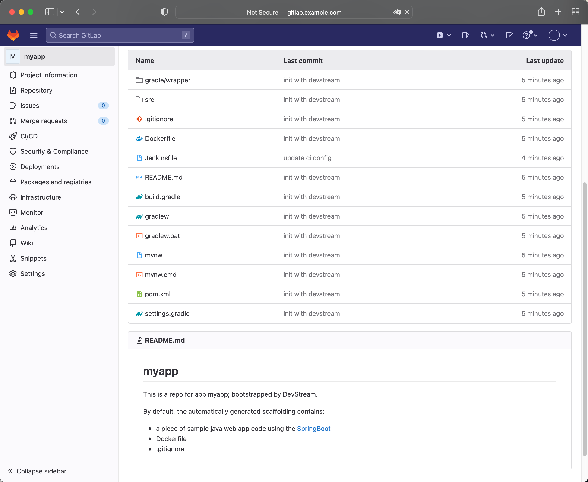
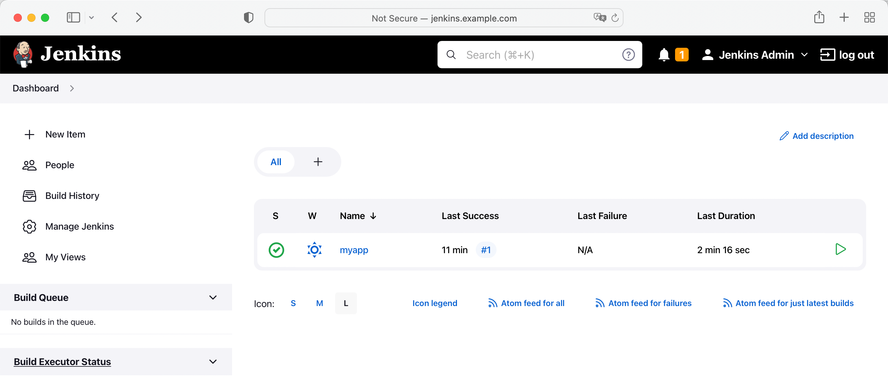
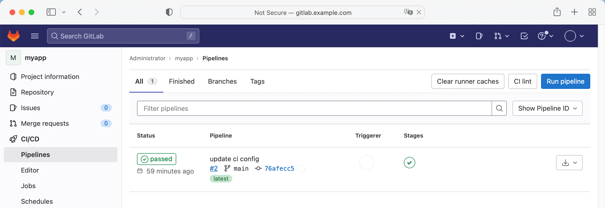
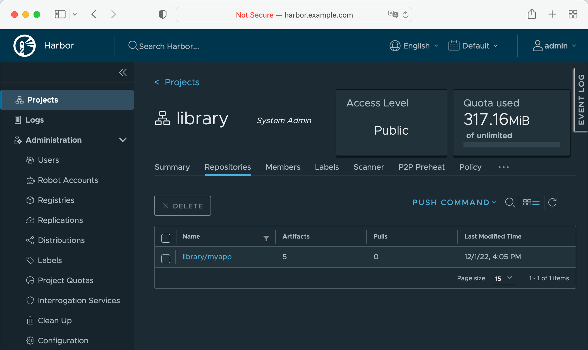

# 搭建 GitLab + Jenkins + Harbor 工具链，管理 Java Spring Boot 项目开发生命周期全流程

## 0、配套视频

我们给本文流程录制了视频 demo，你可以根据自己的习惯决定先看视频版还是文字版：

<div class="video-wrapper">
    <iframe width="1280" height="500" src="https://player.bilibili.com/player.html?cid=931459808&aid=819045554&page=1&as_wide=1&high_quality=1&danmaku=0" allowfullscreen></iframe>
</div>

!!! hint "提示"

    跳转到B站观看清晰度更高。

## 1、概述

本文将介绍如何通过 DevStream 在本地部署 `GitLab + Jenkins + Harbor` 工具链，并且以 Java Spring Boot 项目为例，演示如何通过 DevStream 快速创建 Java Spring Boot 项目脚手架，同时在 Jenkins 上自动创建对应的 Pipeline 实现 Java Spring Boot 项目的 CI 流程。

!!! hint "提示"

    本文基于 kubeadm 部署的单节点 k8s 环境，不适用于 minikube 和 kind 等 docker-in-docker 类型的 k8s 集群。

### 1.1、工作流介绍

本文最终将实现的工具链相关工作流如下图所示：

<figure markdown>
  { width="1000" }
  <figcaption>GitLab + Jenkins + Harbor Toolchain Workflow</figcaption>
</figure>

图中工作流主要是：

1. DevStream 会按需部署 GitLab、Jenkins 和 Harbor 3个工具；
2. DevStream 根据你给定配置，选择默认项目模板或者用户自定义模板创建项目脚手架；
3. DevStream 根据你给定配置，使用 CI 模板创建 CI 流程，过程中会涉及到 CI 工具的配置（比如调用 Jenkins API 完成一些 Jenkins 插件的安装等）；
4. 最终 DevStream 完成全部配置后，如果你提交代码到 DevStream 为你创建的代码库中，GitLab 便会出发 Jenkins 执行相应的 CI 流程，Jenkins 上的流水线运行结果也会实时回显到 GitLab 上，并且这个过程中构建出来的容器镜像会被自动推送到 Harbor 上。

!!! note "注意"

    这个图中的 GitLab 和 GitHub 可以随意互换，它们只是被当做保存项目脚手架模板库存放地址和脚手架模板渲染后的最终项目存放地址，DevStream 对 GitHub 和 GitLab 都支持。换言之，如果你将模板保存到 GitLab，最终项目也托管在 GitLab，便可以完全不依赖 GitHub 而使用 DevStream。

### 1.2、相关插件概览

当前工具链主要涉及如下 DevStream 插件：

- **工具链搭建**
    - [`gitlab-ce-docker`](../../plugins/gitlab-ce-docker.zh.md)：本地部署 GitLab 环境；
    - [`helm-installer`](../../plugins/helm-installer/helm-installer.zh.md)：本地部署 Jenkins 和 Harbor 环境。
- **工具链使用**
    - [`repo-scaffolding`](../../plugins/repo-scaffolding.zh.md)：创建 Java Spring Boot 项目脚手架；
    - [`jenkins-pipeline`](../../plugins/jenkins-pipeline.zh.md)：在 Jenkins 上创建 Pipeline，并打通 GitLab 与 Jenkins，实现 GitLab 上发生 Push/Merge 等事件时触发 Jenkins Pipeline 运行，并且让 Pipeline 状态能够回写到 GitLab。

!!! hint "提示"

    1. 上述插件不是必选集，你可以根据实际情况灵活调整。比如你本地已经有 GitLab 环境了，那么你可以果断忽略 `gitlab-ce-docker` 插件。
    2. 你不再需要关心 repo-scaffolding 和 jenkins-pipeline 这类“非工具部署”相关插件的配置，你只要定义好自己的“app”，剩下的工作 DevStream 会帮你完成。至于 app 如何定义，下文会详细介绍。

### 1.3、部署流程介绍

你将分2步来完成这条工具链的搭建过程。

1. 使用 `gitlab-ce-docker`、`jenkins` 和 `harbor` 三个插件完成 GitLab、Jenkins 和 Harbor 工具的部署；
2. 定义一个 app，来实现 Java Spring Boot 项目脚手架的创建和 Jenkins Pipeline 的配置等工作。

## 2、开始部署 GitLab + Jenkins + Harbor

本节接续介绍如何使用 DevStream 来完成 GitLab、Jenkins 和 Harbor 3个工具的部署。

###  2.1、准备 tools 配置文件（config-tools.yaml）

DevStream 可以简单地以 **local** 作为 Backend，也就是将状态保存到本地文件，如果你在本地测试，可以使用这种方式；
而企业 On premise 环境部署可能需要使用 **k8s** Backend 将状态通过 `kube-apiserver` 存入 etcd，两种方式配置分别如下：

=== "DevStream with 'local' Backend"

    ```yaml title="local Backend"
    config:
      state:
        backend: local
        options:
          stateFile: devstream.state
    ```

=== "DevStream with 'k8s' Backend"

    ```yaml title="k8s Backend"
    config:
      state:
        backend: k8s
        options:
          namespace: devstream
          configmap: state
    ```

下文将以 `local` Backend 为例演示。

在编写 `gitlab-ce-docker` 和 `helm-installer`（用户安装 Jenkins 和 Harbor）这两个插件的配置文件之前，你需要先定义一些变量，这会让后续的配置和维护工作变得更加简单：

```yaml title="config-tools.yaml"
config:
  state:
    backend: local
    options:
      stateFile: devstream.state
vars:
  gitlabHostname: gitlab.example.com
  jenkinsHostname: jenkins.example.com
  harborHostname: harbor.example.com
  harborURL: http://harbor.example.com
  jenkinsAdminUser: admin
  jenkinsAdminPassword: changeme
  gitlabSSHPort: 30022
  gitlabHttpPort: 30080
  gitlabHttpsPort: 30443
```

继续往里面追加工具链相关插件的配置，你的配置文件会扩充成这样：

```yaml title="config-tools.yaml"
config:
  state:
    backend: local
    options:
      stateFile: devstream.state
vars:
  gitlabHostname: gitlab.example.com
  jenkinsHostname: jenkins.example.com
  harborHostname: harbor.example.com
  harborURL: http://harbor.example.com
  jenkinsAdminUser: admin
  jenkinsAdminPassword: changeme
  gitlabSSHPort: 30022
  gitlabHttpPort: 30080
  gitlabHttpsPort: 30443
tools:
- name: gitlab-ce-docker
  instanceID: default
  dependsOn: []
  options:
    hostname: [[ gitlabHostname ]]
    gitlabHome: /srv/gitlab
    sshPort: [[ gitlabSSHPort ]]
    httpPort: [[ gitlabHttpPort ]]
    httpsPort: [[ gitlabHttpsPort ]]
    rmDataAfterDelete: false
    imageTag: "rc"
- name: helm-installer
  instanceID: jenkins-001
  dependsOn: []
  options:
    valuesYaml: |
      serviceAccount:
        create: true
        name: jenkins
      controller:
        adminUser: [[ jenkinsAdminUser ]]
        adminPassword: [[ jenkinsAdminPassword ]]
        ingress:
          enabled: true
          hostName: [[ jenkinsHostname ]]
      enableRawHtmlMarkupFormatter: true
      JCasC:
        defaultConfig: true
- name: helm-installer
  instanceID: harbor-001
  dependsOn: []
  options:
    valuesYaml: |
      externalURL: [[ harborURL ]]
      expose:
        type: ingress
        tls:
          enabled: false
        ingress:
          hosts:
            core: [[ harborHostname ]]
      chartmuseum:
        enabled: false
      notary:
        enabled: false
      trivy:
        enabled: false
      persistence:
        persistentVolumeClaim:
          registry:
            storageClass: ""
            accessMode: ReadWriteOnce
            size: 5Gi
          jobservice:
            storageClass: ""
            accessMode: ReadWriteOnce
            size: 1Gi
          database:
            storageClass: ""
            accessMode: ReadWriteOnce
            size: 1Gi
          redis:
            storageClass: ""
            accessMode: ReadWriteOnce
            size: 1Gi
```

### 2.2、初始化

你可以将上面这个配置文件（config-tools.yaml）放到服务器上任意一个合适的目录，比如 `~/devstream-test/`，然后在该目录下执行：

```shell title="初始化命令"
dtm init -f config-tools.yaml
```

这个命令会帮助你下载所有需要的 DevStream 插件。

### 2.3、开始部署

接着你就可以执行 apply 命令了：

```shell title="开始部署"
dtm apply -f config-tools.yaml -y
```

这个命令执行成功的话，你可以大致看到如下日志：

```shell title="部署日志"
2022-11-30 08:14:05 ℹ [INFO]  Apply started.
2022-11-30 08:14:06 ℹ [INFO]  Using local backend. State file: devstream.state.
2022-11-30 08:14:06 ℹ [INFO]  Tool (gitlab-ce-docker/default) found in config but doesn't exist in the state, will be created.
2022-11-30 08:14:06 ℹ [INFO]  Tool (helm-installer/jenkins-001) found in config but doesn't exist in the state, will be created.
2022-11-30 08:14:06 ℹ [INFO]  Tool (helm-installer/harbor-001) found in config but doesn't exist in the state, will be created.
2022-11-30 08:14:06 ℹ [INFO]  Start executing the plan.
2022-11-30 08:14:06 ℹ [INFO]  Changes count: 3.
2022-11-30 08:14:06 ℹ [INFO]  -------------------- [  Processing progress: 1/3.  ] --------------------
2022-11-30 08:14:06 ℹ [INFO]  Processing: (gitlab-ce-docker/default) -> Create ...
2022-11-30 08:14:06 ℹ [INFO]  Cmd: docker image ls gitlab/gitlab-ce:rc -q.
2022-11-30 08:14:06 ℹ [INFO]  Running container as the name <gitlab>
2022-11-30 08:14:06 ℹ [INFO]  Cmd: docker run --detach --hostname gitlab.example.com --publish 30022:22 --publish 30080:80 --publish 30443:443 --name gitlab --restart always --volume /srv/gitlab/config:/etc/gitlab --volume /srv/gitlab/data:/var/opt/gitlab --volume /srv/gitlab/logs:/var/log/gitlab gitlab/gitlab-ce:rc.
Stdout: 34cdd2a834a1c21be192064eacf1e29536ff45c52562956b97d6d376a5dae11b
2022-11-30 08:14:07 ℹ [INFO]  Cmd: docker inspect --format='{{json .Mounts}}' gitlab.
2022-11-30 08:14:07 ℹ [INFO]  GitLab access URL: http://gitlab.example.com:30080
2022-11-30 08:14:07 ℹ [INFO]  GitLab initial root password: execute the command -> docker exec -it gitlab grep 'Password:' /etc/gitlab/initial_root_password
2022-11-30 08:14:07 ✔ [SUCCESS]  Tool (gitlab-ce-docker/default) Create done.
2022-11-30 08:14:07 ℹ [INFO]  -------------------- [  Processing progress: 2/3.  ] --------------------
2022-11-30 08:14:07 ℹ [INFO]  Processing: (helm-installer/jenkins-001) -> Create ...
2022-11-30 08:14:07 ℹ [INFO]  Filling default config with instance: jenkins-001.
2022-11-30 08:14:07 ℹ [INFO]  Creating or updating helm chart ...
2022/11/30 08:14:09 creating 13 resource(s)
2022/11/30 08:14:09 beginning wait for 13 resources with timeout of 10m0s
2022/11/30 08:14:09 StatefulSet is not ready: jenkins/jenkins. 0 out of 1 expected pods are ready
...
2022/11/30 08:14:49 StatefulSet is not ready: jenkins/jenkins. 0 out of 1 expected pods are ready
2022/11/30 08:14:51 release installed successfully: jenkins/jenkins-4.2.15
2022-11-30 08:14:51 ✔ [SUCCESS]  Tool (helm-installer/jenkins-001) Create done.
2022-11-30 08:14:51 ℹ [INFO]  -------------------- [  Processing progress: 3/3.  ] --------------------
2022-11-30 08:14:51 ℹ [INFO]  Processing: (helm-installer/harbor-001) -> Create ...
2022-11-30 08:14:51 ℹ [INFO]  Filling default config with instance: harbor-001.
2022-11-30 08:14:51 ℹ [INFO]  Creating or updating helm chart ...
2022/11/30 08:14:52 checking 28 resources for changes
2022/11/30 08:14:52 Created a new Secret called "harbor-core" in harbor
...
2022/11/30 08:14:52 Created a new Ingress called "harbor-ingress" in harbor
2022/11/30 08:14:52 beginning wait for 28 resources with timeout of 10m0s
2022/11/30 08:14:52 Deployment is not ready: harbor/harbor-core. 0 out of 1 expected pods are ready
...
2022/11/30 08:15:50 Deployment is not ready: harbor/harbor-jobservice. 0 out of 1 expected pods are ready
2022/11/30 08:15:52 release installed successfully: harbor/harbor-1.10.2
2022-11-30 08:15:52 ✔ [SUCCESS]  Tool (helm-installer/harbor-001) Create done.
2022-11-30 08:15:52 ℹ [INFO]  -------------------- [  Processing done.  ] --------------------
2022-11-30 08:15:52 ✔ [SUCCESS]  All plugins applied successfully.
2022-11-30 08:15:52 ✔ [SUCCESS]  Apply finished.
```

从日志里你可以看到，这时候 GitLab、Jenkins 和 Harbor 就已经部署完成了。

### 2.4、验证三个工具的部署结果

你可以通过如下方式验证 GitLab + Jenkins + Harbor 三个工具的部署结果。

#### 2.4.1、DNS 配置

前面你给 GitLab + Jenkins + Harbor 三个工具的配置文件里都设置了域名，然后你可以直接将这些域名与 IP 的映射关系配置到 DNS 服务器里。

如果没有 DNS 服务器，你也可以直接将域名与 IP 的映射关系配置到 `/etc/hosts` 以及 `CoreDNS` 的 ConfigMap `kube-system/coredns` 里让域名生效。比如我的主机 IP 是 44.33.22.11，这时候可以这样配置：

1. 修改 `/etc/hosts` 文件，添加这条记录：

    ```shell title="dns record"
    44.33.22.11 gitlab.example.com jenkins.example.com harbor.example.com
    ```

2. 修改 `CoreDNS` 的配置，在 ConfigMap `kube-system/coredns` 中添加静态解析记录，执行命令：`kubectl edit cm coredns -n kube-system`，在 hosts(第20行左右) 部分添加：

    ```shell title="dns record"
    44.33.22.11 gitlab.example.com jenkins.example.com harbor.example.com
    ```

    这时候在当前主机上，就可以分别通过如下地址访问到 GitLab、Jenkins 和 Harbor 了，同时 Jenkins 也能顺利地通过域名访问到 GitLab 和 Harbor：
    
    - `GitLab`: http://gitlab.example.com:30080
    - `Jenkins`: http://jenkins.example.com
    - `Harbor`: http://harbor.example.com

最后由于当前刚才 DevStream 使用了 Docker 的方式直接运行的 GitLab，所以不管是主机的 /etc/hosts 还是 CoreDNS 的配置都无法让 GitLab 解析到 Jenkins 的域名，因此你还需要在 GitLab 容器内加一行配置：

```sh
docker exec -it gitlab bash
echo "44.33.22.11 jenkins.example.com" >> /etc/hosts
exit
```

#### 2.4.2、访问 GitLab

你可以在自己的 PC 里配置 `44.33.22.11 gitlab.example.com` 静态域名解析记录，然后在浏览器里通过 `http://gitlab.example.com:30080` 访问到 GitLab：

<figure markdown>
  { width="1000" }
  <figcaption>GitLab login page</figcaption>
</figure>

通过执行如下命令，你可以设置 GitLab 的 root 密码：

```shell title="get GitLab root Password"
docker exec -it gitlab bash # 进入容器
gitlab-rake "gitlab:password:reset" # 执行后按照提示输入用户名 root，回车后输入密码
```

拿到 root 密码后，你可以尝试用 root/YOUR_PASSWORD 来登录 GitLab。因为后面你还需要用到 GitLab 的 token，所以这时候你可以顺手先创建一个 token：

<figure markdown>
  { width="1000" }
  <figcaption>Generate GitLab token</figcaption>
</figure>

#### 2.4.3、访问 Jenkins

前面你可能已经通过 `curl http://jenkins.example.com` 在主机内验证了 Jenkins 的网络连通性，想要远程通过域名访问 Jenkins，你还需要在自己的 PC 里配置 `44.33.22.11 jenkins.example.com` 静态域名解析记录。

接着在浏览器里通过 `http://jenkins.example.com` 就可以访问到 Jenkins 了：

<figure markdown>
  { width="1000" }
  <figcaption>Jenkins login page</figcaption>
</figure>

Jenkins 的 admin 用户初始登录密码是 `changeme`，如果你仔细看了前面 dtm 使用的配置文件，可以发现这是在配置文件里指定的。你可以尝试用 `admin/changeme` 登录 Jenkins 检查功能是否正常，不过当前你不需要在 Jenkins 上进行任何额外的操作。

<figure markdown>
  { width="1000" }
  <figcaption>Jenkins dashboard</figcaption>
</figure>

#### 2.4.4、访问 Harbor

前面你可能也已经通过 `curl http://harbor.example.com` 在主机内验证了 Harbor 的网络连通性，同样你可以通过 `docker login harbor.example.com:80` 命令来尝试登录 Harbor。

现在你需要在自己的 PC 里配置 `44.33.22.11 harbor.example.com` 静态域名解析记录。

接着你可以在浏览器里通过 `http://harbor.example.com` 访问到 Harbor：

<figure markdown>
  { width="1000" }
  <figcaption>Harbor login page</figcaption>
</figure>

Harbor 的 admin 用户初始登录密码是 `Harbor12345`，你可以尝试用 `admin/Harbor12345` 登录 Harbor 检查功能是否正常，不过当前你同样也不需要在 Harbor 上进行任何额外的操作。

<figure markdown>
  { width="1000" }
  <figcaption>Harbor dashboard</figcaption>
</figure>

## 3、开始应用 apps

本节你将继续使用 DevStream apps 管理能力实现一个 Java Spring Boot 项目的脚手架创建和 CI 流程配置等过程。

### 3.1、准备 apps 配置文件（config-apps.yaml）

前面你已经掌握了“状态”和“变量”等的配置方式，结合 apps，你可以编写如下配置文件：

```yaml title="config-apps.yaml"
config:
  state:
    backend: local
    options:
      stateFile: devstream-app.state
vars:
  appName: myapp
  gitlabURL: http://gitlab.example.com:30080
  jenkinsURL: http://jenkins.example.com
  harborURL: http://harbor.example.com
apps:
- name: [[ appName ]]
  spec:
    language: java
    framework: springboot
  repo:
    url: [[ gitlabURL ]]/root/[[ appName ]].git
    branch: main
  repoTemplate:
    url: https://github.com/devstream-io/dtm-repo-scaffolding-java-springboot.git
  ci:
  - type: template
    templateName: ci-pipeline
pipelineTemplates:
- name: ci-pipeline
  type: jenkins-pipeline
  options:
    branch: main
    jenkins:
      url: [[ jenkinsURL ]]
      user: admin
      enableRestart: true
    imageRepo:
      user: admin
      url: [[ harborURL ]]/library
```

可以看到这里的状态配置换成了 devstream-app.state，这里需要保证和前面 tools 所使用的状态文件不是同一个。

### 3.2、让 apps 配置生效

你还记得刚才添加了一个 GitLab 的 token 不？这个 token 需要被设置到环境变量里：

```shell title="环境变量配置"
export GITLAB_TOKEN=YOUR_GITLAB_TOKEN
```

同时如果你的 Harbor 没有去修改密码，这时候默认密码应该是 Harbor12345，你同样需要将 Harbor 密码配置到环境变量里：

```shell title="环境变量配置"
export IMAGE_REPO_PASSWORD=Harbor12345
```

此外由于 DevStream 需要调用 Jenkins 的 API 来帮你创建流水线，所以你还需要告诉 DevStream Jenkins 的密码：

```shell title="环境变量配置"
export JENKINS_PASSWORD=changeme
```

你可以将这个配置文件放到服务器上同一个目录，比如 `~/devstream-test/`，然后在该目录下执行：

```shell title="初始化"
dtm init -f config-apps.yaml
```

这时候 DevStream 会帮你下载 `jenkins-pipeline` 和 `repo-scaffolding` 两个插件，最终将有这两个插件来帮你完成代码库脚手架的创建和 Jenkins 流水线的配置。

接着你可以继续执行如下命令

```shell
dtm apply -f config-apps.yaml -y
```

如果 apply 命令执行成功的话，你可以看到大致如下日志：

```shell title="执行日志"
2022-12-02 01:04:44 ℹ [INFO]  Delete started.
2022-12-02 01:04:44 ℹ [INFO]  Using local backend. State file: devstream-app.state.
2022-12-02 01:04:44 ℹ [INFO]  Tool (jenkins-pipeline/myapp) will be deleted.
2022-12-02 01:04:44 ℹ [INFO]  Tool (repo-scaffolding/myapp) will be deleted.
2022-12-02 01:04:44 ℹ [INFO]  Start executing the plan.
2022-12-02 01:04:44 ℹ [INFO]  Changes count: 2.
2022-12-02 01:04:44 ℹ [INFO]  -------------------- [  Processing progress: 1/2.  ] ----------
----------
2022-12-02 01:04:44 ℹ [INFO]  Processing: (jenkins-pipeline/myapp) -> Delete ...
2022-12-02 01:04:46 ℹ [INFO]  Prepare to delete 'jenkins-pipeline_myapp' from States.
2022-12-02 01:04:46 ✔ [SUCCESS]  Tool (jenkins-pipeline/myapp) delete done.
2022-12-02 01:04:46 ℹ [INFO]  -------------------- [  Processing progress: 2/2.  ] --------------------
2022-12-02 01:04:46 ℹ [INFO]  Processing: (repo-scaffolding/myapp) -> Delete ...
2022-12-02 01:04:46 ℹ [INFO]  Prepare to delete 'repo-scaffolding_myapp' from States.
2022-12-02 01:04:46 ✔ [SUCCESS]  Tool (repo-scaffolding/myapp) delete done.
2022-12-02 01:04:46 ℹ [INFO]  -------------------- [  Processing done.  ] --------------------
2022-12-02 01:04:46 ✔ [SUCCESS]  All plugins deleted successfully.
2022-12-02 01:04:46 ✔ [SUCCESS]  Delete finished.
root@dtm-realk8sdev:~# ./dtm apply -y -f config-apps.yaml
2022-12-02 01:04:55 ℹ [INFO]  Apply started.
2022-12-02 01:04:55 ℹ [INFO]  Using local backend. State file: devstream-app.state.
2022-12-02 01:04:55 ℹ [INFO]  Tool (repo-scaffolding/myapp) found in config but doesn't exist in the state, will be created.
2022-12-02 01:04:55 ℹ [INFO]  Tool (jenkins-pipeline/myapp) found in config but doesn't exist in the state, will be created.
2022-12-02 01:04:55 ℹ [INFO]  Start executing the plan.
2022-12-02 01:04:55 ℹ [INFO]  Changes count: 2.
2022-12-02 01:04:55 ℹ [INFO]  -------------------- [  Processing progress: 1/2.  ] --------------------
2022-12-02 01:04:55 ℹ [INFO]  Processing: (repo-scaffolding/myapp) -> Create ...
2022-12-02 01:04:55 ℹ [INFO]  github start to download repoTemplate...
2022-12-02 01:04:56 ✔ [SUCCESS]  Tool (repo-scaffolding/myapp) Create done.
2022-12-02 01:04:56 ℹ [INFO]  -------------------- [  Processing progress: 2/2.  ] --------------------
2022-12-02 01:04:56 ℹ [INFO]  Processing: (jenkins-pipeline/myapp) -> Create ...
2022-12-02 01:04:57 ℹ [INFO]  jenkins plugin imageRepo start config...
2022-12-02 01:04:57 ⚠ [WARN]  jenkins gitlab ssh key not config, private repo can't be clone
2022-12-02 01:04:57 ℹ [INFO]  jenkins start config casc...
2022-12-02 01:04:59 ✔ [SUCCESS]  Tool (jenkins-pipeline/myapp) Create done.
2022-12-02 01:04:59 ℹ [INFO]  -------------------- [  Processing done.  ] --------------------
2022-12-02 01:04:59 ✔ [SUCCESS]  All plugins applied successfully.
2022-12-02 01:04:59 ✔ [SUCCESS]  Apply finished.
```

### 3.3、查看执行结果

这时候你可以在 GitLab 上看到 dtm 为你准备的 Java Spring Boot 项目脚手架：

<figure markdown>
  { width="1000" }
  <figcaption>Repo scaffolding</figcaption>
</figure>

接着你可以登录 Jenkins，查看 dtm 为你创建的 Pipeline：

<figure markdown>
  { width="1000" }
  <figcaption>Jenkins pipeline</figcaption>
</figure>

这个 Pipeline 会自动执行一次，执行完成后回到 GitLab，你可以看到 Jenkins 回写的 Pipeline 状态：

<figure markdown>
  { width="1000" }
  <figcaption>GitLab Status</figcaption>
</figure>

后面每当 GitLab 上这个 repo 发生 Push 或者 Merge 事件的时候，就会触发 Jenkins 上的 Pipeline 运行。

当然，在 Harbor 上你可以找到 CI 流程构建出来的容器镜像：

<figure markdown>
  { width="1000" }
  <figcaption>Image in Harbor</figcaption>
</figure>

## 4、环境清理

你可以通过如下命令清理环境：

```shell title="环境清理命令"
dtm delete -f config-apps.yaml -y
dtm delete -f config-tools.yaml -y
```
