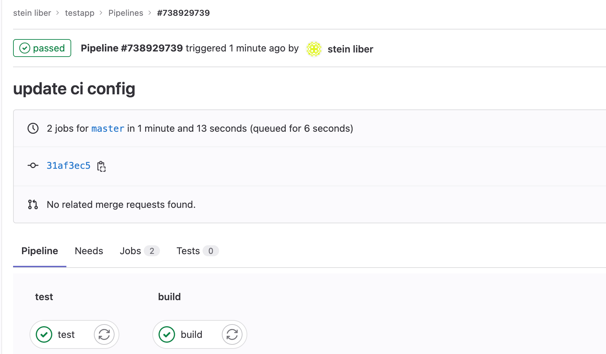

# GitLab + GitLab CI with DTM Tools

DevStream has two abstractions: [Tools](../../core-concepts/tools.md) and [Apps](../../core-concepts/apps.md).

[The previous use case](./4-gitlab-dtm-apps.md) uses `Apps`. We can also achieve the same result with `Tools`, and here's how:

## ENV Vars

The following environment variables are required for this to work:

```bash
export GITLAB_TOKEN="YOUR_GITLAB_TOKEN"
export IMAGE_REPO_PASSWORD="YOUR_DOCKERHUB_TOKEN_HERE"
```

---

## Config File

```yaml
config:
  state:
    backend: local
    options:
      stateFile: devstream.state

vars:
  gitlabUser: YOUR_GITLAB_USERNAME
  dockerUser: YOUR_DOCKERHUB_USERNAME
  app: testapp

tools:
- name: helm-installer
  instanceID: argocd
- name: repo-scaffolding
  instanceID: myapp
  options:
    destinationRepo:
      owner: [[ gitlabUser ]]
      name: [[ app ]]
      branch: master
      scmType: gitlab
      # set env GITLAB_TOKEN
      token: [[ env GITLAB_TOKEN ]]
    sourceRepo:
      org: devstream-io
      name: dtm-repo-scaffolding-python-flask
      scmType: github
- name: gitlab-ci
  instanceID: flask
  dependsOn: [ "repo-scaffolding.myapp" ]
  options:
    scm:
      owner: [[ gitlabUser ]]
      name: [[ app ]]
      branch: master
      scmType: gitlab
      token: [[ env GITLAB_TOKEN ]]
    pipeline:
      language:
        framework: flask
        name: python
      imageRepo:
        user: [[ dockerUser ]]
        # set env IMAGE_REPO_PASSWORD
        password: [[ env IMAGE_REPO_PASSWORD ]]
- name: argocdapp
  instanceID: default
  dependsOn: [ "helm-installer.argocd", "gitlab-ci.flask" ]
  options:
    app:
      name: [[ app ]]
      namespace: argocd
    destination:
      server: https://kubernetes.default.svc
      namespace: default
    source:
      valuefile: values.yaml
      path: helm/[[ app ]]
      repoURL: ${{repo-scaffolding.myapp.outputs.repoURL}}
      token: [[ env GITLAB_TOKEN ]]
    imageRepo:
      user: [[ dockerUser ]]
      password: [[ env IMAGE_REPO_PASSWORD ]]
```

Update the "YOUR_GITLAB_USERNAME" and "YOUR_DOCKERHUB_USERNAME" in the above file accordingly.

**Notes:**

Your `GitLab` must have shared runners to run `gitlab-ci`, If you want to create a runner automatically, you can refer to [gitlab-ci plugin docs](../../plugins/gitlab-ci.md) about how to generate a runner by `DevStream`.

---

## Run

First, initialize:

```bash
# this downloads the required plugins, according to the config file, automatically.
dtm init -f config.yaml
```

Then we apply it by running:

```bash
dtm apply -f config.yaml -y
```

Now we can see the repo has been created in `GitLab` and the image has been uploaded to `Dockerhub`.

<figure markdown>
  { width="1000" }
  <figcaption>GitLab CI</figcaption>
</figure>

In your `Kubernetes` cluster, the app pod is created in the default namespace.

```bash
$ kubectl get application -n argocd
NAME      SYNC STATUS   HEALTH STATUS
testapp   Synced        Healthy
$ kubectl get deploy -n default
NAME      READY   UP-TO-DATE   AVAILABLE   AGE
testapp   1/1     1            1           4m27s
$ kubectl get pods -n default
NAME                       READY   STATUS    RESTARTS   AGE
testapp-5f9c75b4f6-57d9p   1/1     Running   0          3m48s
```